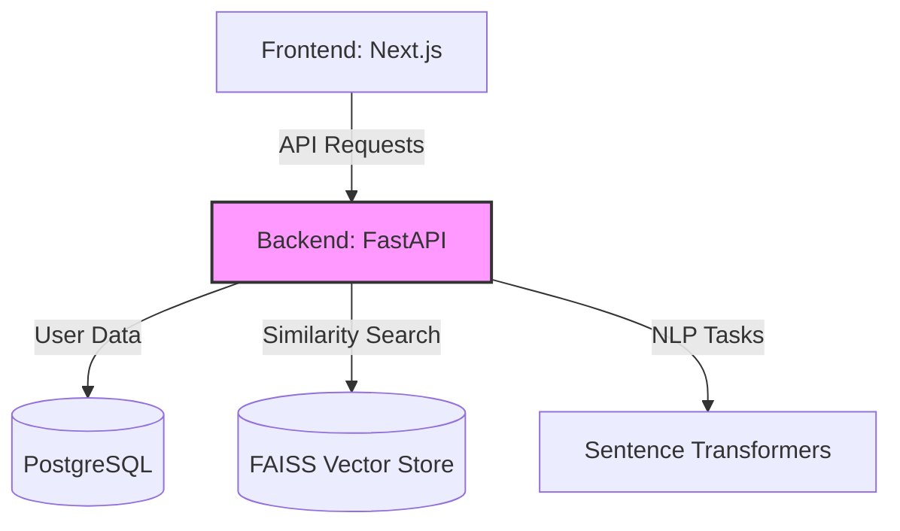

# AI-Powered Resume-Job Matching & Hiring Intelligence System


## 🚀 Overview
The **AI-Powered Hiring Intelligence System** is a state-of-the-art recruitment platform designed to bridge the gap between talent and opportunity. By leveraging advanced Natural Language Processing (NLP) and machine learning ranking models, it provides highly accurate, semantic matching between candidate resumes and job descriptions.

[](https://fastapi.tiangolo.com/)
[](https://nextjs.org/)
[](https://www.postgresql.org/)
[](https://reactjs.org/)

---

## ✨ Key Features
- **AI-Driven Semantic Matching**: Uses Sentence Transformers (`all-MiniLM-L6-v2`) and FAISS to match resumes based on context, not just keywords.
- **Intelligent Resume Parsing**: Automatically extracts skills, experience, and education from candidate resumes.
- **Role-Based Dashboards**: Tailored interfaces for both Recruiter (hiring management) and Candidates (job discovery).
- **Explainable AI**: Provides detailed match scores and explanations for every recommendation.
- **Scalable Architecture**: Built with a modular microservices approach, ready for containerization.

---

## 🏗️ System Architecture
The system follows a modern decoupled architecture, ensuring high performance and scalability.



---

## 🛠️ Tech Stack & Infrastructure
- **Backend**: Python (FastAPI), Uvicorn
- **Frontend**: TypeScript, React (Next.js), TailwindCSS
- **Database**: PostgreSQL (Structured Data)
- **Vector DB**: FAISS (High-dimensional Vector Search)
- **AI/ML**: Sentence Transformers, PyTorch, NLTK
- **Containerization**: Docker, Docker Compose

---

## 📂 Project Structure
```bash
├── backend/            # FastAPI Application & AI Logic
├── frontend/           # Next.js Application
├── database/           # SQL Migration Scripts
├── docker/             # Docker Configuration
└── README.md           # Project Documentation
```

---

## 🚦 Getting Started

### 1️⃣ Prerequisites
- Docker & Docker Compose
- Python 3.9+
- Node.js 18+

### 2️⃣ Installation & Setup
1. **Clone the Repository**
   ```bash
   git clone https://github.com/Shrikant-sharma-9/Mini_project_4thsem.git
   cd Antigravity
   ```

2. **Spin up Infrastructure**
   ```bash
   docker-compose up -d
   ```

3. **Backend Setup**
   ```bash
   cd backend
   python -m venv venv
   source venv/bin/activate  # Windows: venv\Scripts\activate
   pip install -r requirements.txt
   python main.py
   ```

4. **Frontend Setup**
   ```bash
   cd ../frontend
   npm install
   npm run dev
   ```

---

## 🛡️ License
This project is licensed under the MIT License - see the LICENSE file for details.

---
Developed with ❤️ by the Hiring Intelligence Team.
